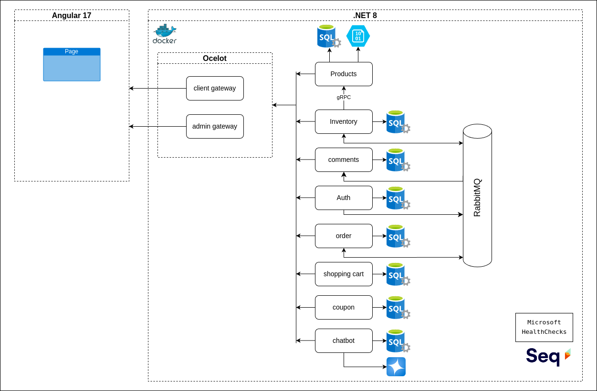

## .NET Shop Microservice

<hr/>

### Micro store NET

- is a .NET e-commerce application built with in microservice architecture dockerized in containers.

<hr/>

### Features


- User Authentication and Authorization: Secure user login and role-based access control through the Authentication microservice.

- Product Catalog Management: List, search, and filter products for customers via the Product microservice.

- Inventory Validation: Real-time inventory checks using gRPC communication between the Product and Inventory microservices.

- Order Processing: Place, track, and manage orders, integrated with inventory validation through RabbitMQ messaging.

- Comment System: Allow users to leave comments on products, with user data fetched from the Authentication service via RabbitMQ.

- Admin Management: Administrative features like creating, updating, and deleting products, inventory, and orders through a dedicated Admin Gateway.

- Frontend Integration: Angular-based frontend connected to separate gateways for client and admin functionalities.

- Event-Driven Messaging: Asynchronous communication between microservices using RabbitMQ for decoupled and scalable architecture.

- Logging and Monitoring: Centralized logging and performance tracking through Seq.

- Database Persistence: Reliable data storage using SQL Server with persistent volumes.

<hr/>

### Getting Started


- To run the application locally, make sure you have Docker Desktop installed and running on your system.
- Run the following command:

``` docker compose up --build ```

- Get the Angular Frontend in: https://github.com/Sergip8/Angular_shop_microservices

<hr/>

### Application Architecture
The following diagram illustrates the structure of the application and gives an overview of how each of these microservices interact.

